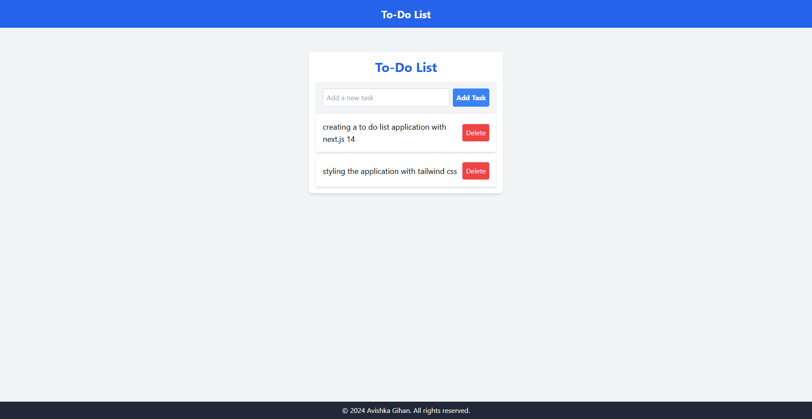

# Todo App

A simple and intuitive todo list application built with React and TypeScript. Users can add, delete, and mark tasks as complete, with tasks persisted in the browser's local storage.



## Features

- Add new tasks
- Mark tasks as complete
- Delete tasks
- Tasks are saved in the browser's local storage

## Installation

1. Clone the repository:

```bash
git clone https://github.com/your-username/todo-app.git
```

2. Navigate to the project directory:

```bash
cd todo-app
```

3. Install dependencies:

```bash
npm install
```

4. Start the development server:

```bash
npm start
```

5. Open your browser and visit [http://localhost:3000](http://localhost:3000) to see the app.

## Usage

- Enter a task in the input field and press "Add Task" to add a new task to the list.
- Click on a task to mark it as complete. Completed tasks will be displayed with a strikethrough.
- Click the "Delete" button next to a task to remove it from the list.
- Your tasks will be automatically saved in the browser's local storage, so they will persist even after you close and reopen the app.

## Contributing

Contributions are welcome! If you find any issues or have suggestions for improvements, please feel free to open an issue or submit a pull request.

1. Fork the repository
2. Create your feature branch (`git checkout -b feature/your-feature`)
3. Commit your changes (`git commit -am 'Add some feature'`)
4. Push to the branch (`git push origin feature/your-feature`)
5. Create a new Pull Request

## License

This project is licensed under the MIT License.
